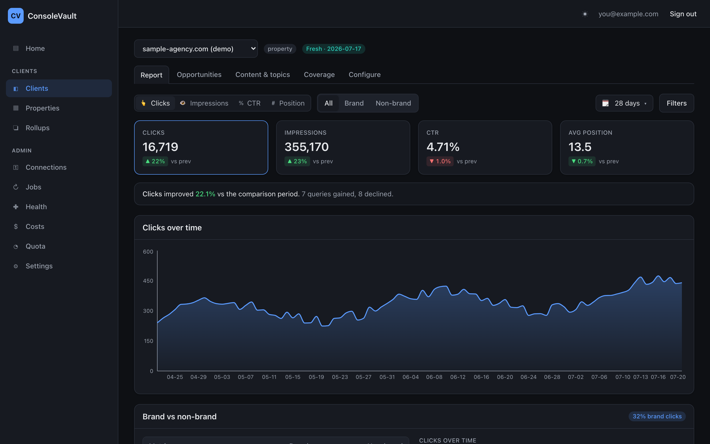
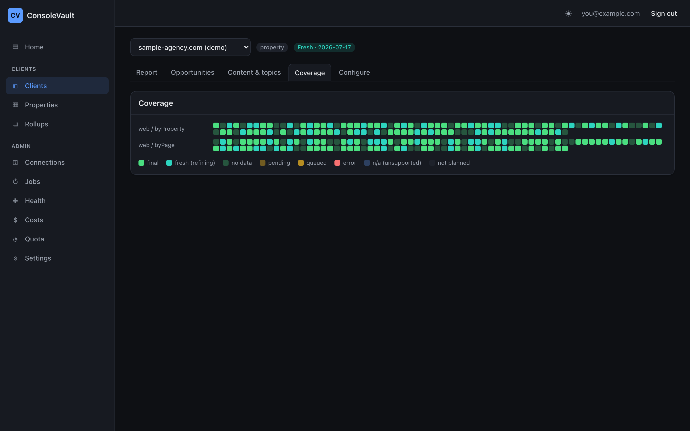
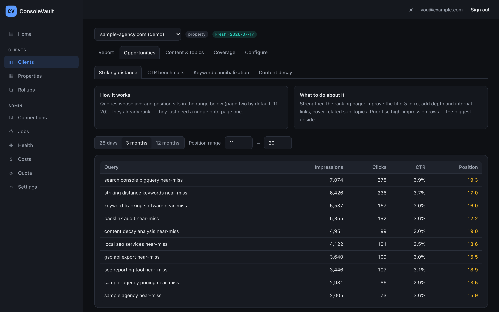
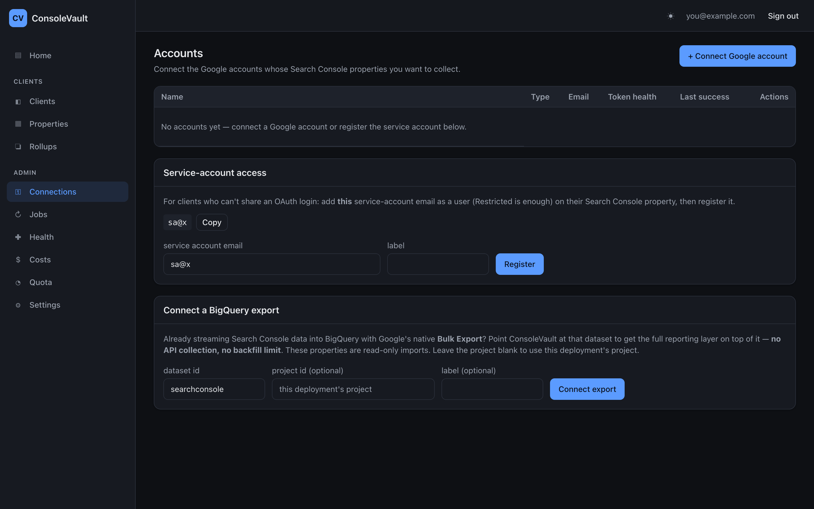

# ConsoleVault

**All your Google Search Console data, in your own BigQuery — backfilled 16 months, every
property, one warehouse.** Open source (Apache 2.0), self-deployed into your own Google Cloud
project. Your data never touches anyone else's infrastructure.

## Install it in one click

<div align="center">

[](https://shell.cloud.google.com/cloudshell/editor?cloudshell_git_repo=https://github.com/pdimo/consolevault.git&cloudshell_tutorial=.cloudshell/tutorial.md&cloudshell_print=.cloudshell/welcome.txt)

</div>

Click the button, type `./bootstrap.sh`, and answer **two questions from a menu** — which project,
and where your data should live. About ten minutes later it prints your **URL and admin password**.

**Nothing to install. No Terraform, no image build, no Google OAuth client, no consent screen, no
command-line flags.** It runs entirely in your browser via Cloud Shell.

<!-- PENDING ASSET — uncomment once the file exists:

-->

|                             |                                                                                          |
| --------------------------- | ---------------------------------------------------------------------------------------- |
| **1. Click the button**     | Cloud Shell opens in your browser with ConsoleVault already cloned. Run `./bootstrap.sh`. |
| **2. Pick two things**      | Your Google Cloud project, and your data location (United States, Europe, Australia — Sydney, …) — both from a numbered menu. |
| **3. Sign in**              | It prints a URL and a one-time admin password. Open, sign in, and connect your Search Console data. |

> Your data **location is permanent**, which is why the menu asks up front. Re-running
> `./bootstrap.sh` is safe — it's idempotent.

Then add your Search Console data: open **Connections**, and either grant the shown
`sa-collector@…` email access in Search Console (no Google setup at all), or connect a Google
account ([guided walkthrough](./docs/CONNECT-GOOGLE-ACCOUNT.md)). Track a property and collection
starts immediately.

**Prefer full control?** Large or advanced installs can deploy via **Terraform** instead —
least-privilege dataset-scoped IAM, a billing budget, and Google sign-in. See
**[docs/DEPLOY.md](./docs/DEPLOY.md)**. Both paths deploy into your own project; they don't mix.

---

## What you get



|                                                                                               |                                                                                      |
| --------------------------------------------------------------------------------------------- | ------------------------------------------------------------------------------------ |
| **Coverage heatmap** — provable per-cell completeness across 16 months                        | **Opportunities** — striking distance, CTR benchmark, cannibalization, decay         |
| [](./docs/images/coverage-heatmap.png) | [](./docs/images/opportunities.png) |

**Connect a native BigQuery Bulk Export** and get the full reporting layer with no API collection
([details](./docs/NATIVE-EXPORT.md)):



_(Screenshots use the built-in **Sample data** demo client — no real data.)_

Built for SEO/marketing agencies managing many GSC properties across multiple Google accounts who
need backdated, complete, multi-property data in one warehouse. See [`SPEC.md`](./SPEC.md) for the
full design (source of truth).

## Why self-deploy (the OAuth / CASA advantage)

`https://www.googleapis.com/auth/webmasters.readonly` is a **sensitive** scope. A central hosted
SaaS using it would trigger Google brand verification plus an annual CASA security assessment
($500–$4,500/yr). Google **explicitly exempts internal-use-within-an-organization and
dev/test/staging** apps. Because each agency **self-deploys its own OAuth client in its own GCP
project for its own data**, ConsoleVault qualifies for that exception — no consent-screen
verification, no CASA. This is a structural advantage; do not drift to a central-hosted model
without budgeting for CASA.

## Already using Google's native BigQuery export?

Google's native **Bulk Export** streams GSC data into a BigQuery dataset you own, but it's
forward-only (no backfill), owner-only, and one project per property — unworkable as an agency's
sole pipeline. ConsoleVault's API collection solves exactly that (backfilled, multi-account,
multi-property). But the two are complementary: if you already run the native export, **connect
that dataset** and ConsoleVault puts its whole reporting layer on top of it — no collection, and no
50K-row/day API ceiling. Use API collection for backfilled history and native export for your
largest properties. **Connections → Connect a BigQuery export**, or see
**[docs/NATIVE-EXPORT.md](./docs/NATIVE-EXPORT.md)**.

## Configuration (per-install, nothing hardcoded)

Deploy-time values live in `terraform/terraform.tfvars` (see
[`terraform.tfvars.example`](./terraform.tfvars.example)):

| Variable                        | Purpose                                            | Default       |
| ------------------------------- | -------------------------------------------------- | ------------- |
| `project_id`                    | Your GCP project                                   | — (required)  |
| `bq_location`                   | BigQuery + Firestore location (**permanent**)      | `US`          |
| `region`                        | Cloud Run / Tasks / Workflows region               | `us-central1` |
| `admin_emails`                  | Emails allowed to sign in to the UI                | `[]`          |
| `billing_account`               | Billing account id for the budget (blank disables) | `""`          |
| `budget_amount`                 | Monthly budget cap, in the account's own currency  | `50`          |
| `daily_schedule`                | Cron for the daily pipeline                        | `0 9 * * *`   |
| `token_health_schedule`         | Cron for the token-health sweep                    | `0 */6 * * *` |
| `default_partition_expiry_days` | BigQuery retention (null = forever)                | `null`        |
| `native_export_datasets`        | GSC native Bulk Export dataset ids to read (§12)   | `[]`          |

Runtime values live in the **Settings UI**: collection defaults (offset/backfill/types/aggs) and
the **alert email** (each operator sets their own — the app provisions the Monitoring channel).

## Operations

- **Alerting** — set an alert email in Settings to get Cloud Monitoring emails when an account's
  token goes unhealthy, the collector errors spike, or no collection succeeds for 24h. A
  token-health sweep runs every 6h. (SPEC §3 — a stale token silently zeroing collection is the #1
  risk.)
- **Costs** — the **Costs** page shows BigQuery storage by dataset and an estimated monthly storage
  cost; collection itself is near-free. A Cloud Billing budget alerts at 50/90/100% so you never get
  a surprise bill. Opt in to **real spend** right on the Costs page — a guided one-time Console step,
  then the panel auto-switches from estimates to actual billing ([docs/BILLING-EXPORT.md](./docs/BILLING-EXPORT.md)).
- **Materialized group views** — opt-in per group for faster BI
  ([docs/MATERIALIZED-VIEWS.md](./docs/MATERIALIZED-VIEWS.md)).
- **Quota & capacity** — the **Quota** page shows measured Search Console API usage against Google's
  limits and "how many more properties you can add" (almost always: far more than you'll need). See
  **[docs/QUOTA.md](./docs/QUOTA.md)** and **[docs/API-EFFICIENCY.md](./docs/API-EFFICIENCY.md)**.
- **Freshness** — see below; there is no look-back window to tune.

## Data model

Analytics land in BigQuery as **one table per property** in datasets `gsc_byProperty`, `gsc_byPage`,
`gsc_totals`; control-plane state lives in Firestore; `task_logs` is append-only.

- **Wildcard views** (`gsc_views.byProperty_all` / `byPage_all` / `totals_all`) span every property
  with a `source_table` column — query the whole warehouse at once. They self-maintain (new
  properties appear automatically). Connect Looker Studio to these: **[docs/LOOKER.md](./docs/LOOKER.md)**.
- **Property groups** create impression-weighted union views across a chosen set of properties.

## Data freshness

GSC days are labeled in **Pacific Time**, and recent days are _fresh_ (still being processed and
subject to change) before Google finalizes them. ConsoleVault collects with `dataState=all`, locks
a day once it's final (using `first_incomplete_date`), and re-collects fresh days automatically
until they finalize — there is no "look-back window." See
**[docs/DATA-FRESHNESS.md](./docs/DATA-FRESHNESS.md)**.

## Repository layout

```text
apps/
  api/      Cloud Run control-plane API + management endpoints (sa-api)
  web/      React + Vite SPA (Google Sign-In, heatmap, doctor, jobs, groups, costs, settings)
  workers/  Cloud Run workers — discover / collector / orchestrator (sa-collector / sa-workflows)
packages/
  types/    Shared domain types (single source of truth)
  gsc/      Google Search Console API client + Pacific-Time date utils
  bq/       BigQuery schema, write helpers, views
  store/    Firestore repositories + auth/token helpers
  config/   Shared config / env loader
tools/
  oauth-helper/  Local OAuth helper (writes refresh tokens straight to Secret Manager)
terraform/  The only deploy mechanism (GCS backend + state locking)
```

## Local development

```bash
pnpm install
pnpm typecheck && pnpm lint && pnpm build && pnpm test
```

## Contributing & community

- **[Contributing guide](./CONTRIBUTING.md)** — how to build, test, and open a PR.
- **[Security policy](./SECURITY.md)** — report a vulnerability privately (please don't open a
  public issue for security problems).
- **[Code of Conduct](./CODE_OF_CONDUCT.md)** — expected behaviour in community spaces.

## License

[Apache 2.0](./LICENSE).
